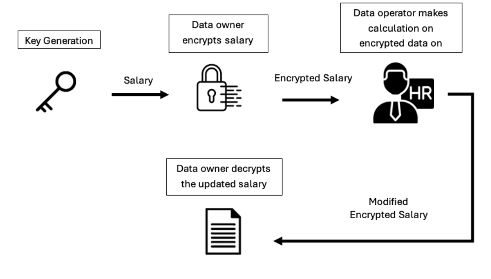

# Homomorphic Encryption Of Election Data
## Open-source Libraries for Homomorphic Encryption
There exists a multitude of open-source libraries for homomorphic encryption. Most notably, there exists a curated list of amazing homeopathic encryption libraries, software, and resources from which we extracted 3 potential libraries for applying this privacy-preserving technology [3]. The 3 libraries are Microsoft Seal, TenSEAL, and cuHE.

### Microsoft Seal
“Microsoft Seal is a C++ fully homomorphic encryption (FHE) library for implementing BFV and CKKS schemes [3].” Microsoft SEAL utilizes these 2 homomorphic encryption schemes to perform different operations. “The BFV scheme allows for modular arithmetic to be performed on encrypted integers (modulo operation) while the CKKS scheme allows for additions and multiplications on encrypted real or complex numbers, but only yields approximate results [5].” Microsoft SEAL offers state-of-the-art performance, a simple and convenient API but has a “steep learning curve [4, 5].” Microsoft SEAL provides several detailed and thoroughly commented examples and reference materials for users to study and understand its API which is necessary to achieve optimal performance and highly discourages the reusing of code from the examples as they show off individual functionality and are not optimized or efficient [5].

### TenSEAL
TenSEAL is a C++ library with a Python API for doing homomorphic encryption operations on tensors, built on top of Microsoft SEAL [7].” Its biggest feature is the ability to perform element-wise addition, subtraction, and multiplication on encrypted-encrypted vectors and encrypted-plain vectors [7]. This is powerful because it enables multidimensional analysis/calculation while preserving privacy. For example, it allows for homomorphic facial recognition [8]. In terms of performance, it preserves the efficiency of Microsoft SEAL, thus offering similar computational time complexity. TenSEAL’s Python API is also accessible as it provides users with a basic code example with comments but also tutorials on more advanced applications such as training and evaluating a logistic regression model on encrypted data for heart disease prediction [7].

### cuHE
CUDA Homomorphic Encryption Library (cuHE) is a GPU-accelerated somewhat homomorphic encryption (SWHE) C++/CUDA library for homomorphic encryption (HE) schemes…[9]. cuHE leverages the computing power and memory bandwidth of NVIDIA graphic cards and NVIDIA's CUDA platform to increase the performance of homomorphic encryption applications. According to NVIDIA, CUDA allows developers to dramatically speed up computing applications by harnessing the power of parallelization of computational-intensive applications [6]. This library performs various optimizations to boost performance for encrypted addition, multiplication, and polynomial arithmetic (polynomial as operands) by adopting the Chinese remainder theorem (CRT), the number-theoretic transform (NTT), and Barrett reduction based methods as well as various memory minimization techniques [1, 9]. The library provides users with some examples of its implementation to learn its interface and API.

### Comparison
All 3 homomorphic libraries offer different features that may appeal to a developer depending on their application and skill level. Microsoft SEAL and TenSEAL are both FHE offering a multitude of operations and high depth that allows for fast performance in a variety of computing operations while offering many code examples and tutorials to learn from. However, TenSEAL may be the better option here if multi-dimensional computations are required. On the other hand, cuHE offers very high computing performance at the cost of limited depth (as it’s a SWHE). Additionally, it requires the user to possess an NVIDIA GPU (which can be quite expensive for high-computational applications) and has a rather sparse number of code examples to learn from. For our implementation, we decided to use TenSEAL to leverage the use of vectors. We decided to avoid cuHE as well because not everyone owns an NVIDIA GPU.

| Library | Type | Operations | Accessibility | Performance |
| ------- | ---- | ---------- | ------------- | ----------- |
| Microsoft Seal | FHE | Modulo, addition, subtraction, multiplication, division with infinite depth on encrypted integers, real numbers, and complex numbers | Steep learning curve but rather simple API | Fast |
| TenSEAL | FHE | Modulo, addition, subtraction, multiplication, division with infinite depth on encrypted integers, real numbers, complex numbers, and tensors (vectors) | Approachable with Python tutorials | Fast |
| cuHE | SWHE | Addition, subtraction, division, and multiplication on encrypted integers, real numbers, complex numbers, and polynomials. | Requires NVIDIA GPU for CUDA, Limited code examples/tutorials | Very fast |


## Walkthrough
For our implementation we chose to use a walkthrough of the TenSEAL library using python [2] . The goal of the walkthrough is to simulate an employee sending an encrypted version of their salary to the HR department, allowing them to perform calculations on it to add a wage increase and a bonus, and then rewriting the unencrypted result to a new file. The three main components of this walkthrough are the data owner, data operator, and the key generator. In this scenario, the employee is the data owner because it is their sensitive information that is being handled and they have the rights over it. The data operator is the HR department, because they are manipulating and performing calculations with the encrypted sensitive data.

### Files
- [DataOwner.py](./salary/DataOwner.py)     →   Takes their own personal data and encrypts it to a new file
- [DataOperator.py](./salary/DataOperator.py)  →   Takes the encrypted files from outputs and performs calculations
- [GenerateKeys.py](./salary/generateKeys.py) →   Generates the necessary encryption keys used for encrypt/decrypt
- Outputs (folder)   →   Holds all of the encrypted salary files
- [Utils.py](./salary/utils.py)  →  Contains utility functions for reading and writing data to a file

### Order of Execution

1. The first step is to generate the keys that can be used for encryption and decryption

```
### [Key Generation](./salary/generateKeys.py) (1st generate public and private keys)
context.generate_galois_keys()
context.global_scale = 2**40
secret_context = context.serialize(save_secret_key = True)
```

2. The second step is for the [data owner](./salary/DataOwner.py) to take their sensitive information and convert it into a CKKS vector that can be used to make calculations on and they send it to the data operator as an encrypted vector.

```
### Encryption Example (Then we can use these keys to encrypt)
context = ts.context_from(utils.read_data("./keys/secret.txt"))
### Lets encrypt $10,000 salary
salary = [10000]
salary_encrypted = ts.ckks_vector(context, salary)
salary_encrypted_proto = salary_encrypted.serialize()
```

3. The third step is for the [data operator](./salary/DataOperator.py) to read the encrypted file, make the proper calculations and then write to a new file the updated but still encrypted salary

```
### Read in the encrypted stuff
salary_proto = utils.read_data("./outputs/salary_encrypted.txt")
salary_encrypted = ts.lazy_ckks_vector_from(salary_proto)
salary_encrypted.link_context(context)

# Lets do a wage increase of 20% (multiply encrypted by 1.2)
wage_increase_rate_plain = ts.plain_tensor([1.2])

# Lets do a wage bonus 600 USD
bonus_increase_rate_plain = ts.plain_tensor([600])

# Do operations
salary_new_encrypted = (salary_encrypted * wage_increase_rate_plain) + bonus_increase_rate_plain
```

4. Lastly the [data owner](./salary/DataOwner.py) can decrypt this file to reveal the salary updates

```
### Decryption Example (Lets decrypt a salary from our example)
m_proto = utils.read_data("./outputs/salary_encrypted.txt")
m = ts.lazy_ckks_vector_from(m_proto)
m.link_context(context)
### Before performing operation on encrypted data, we expect our salary to be $10,000
print(round(m.decrypt()[0], 2))
```

#### Note: CKKS form is used for real numbers and BGV and BFV are used for integer calculations, the walkthrough uses CKKS to more accurately describe salary.

### Diagram of Walkthrough


## Implementation
We decided to base our implementation off of an election system. The ability to vote has become easier as the world’s technology has advanced, with innovations like mail in voting increasing the accessibility of out of state voting. Many have wondered if online voting is the next step, however there are concerns over voter privacy, which is one of the core tenets of the United States election system. In order to showcase a possible solution, we have used partial homomorphic encryption to implement a model of a popular vote and an electoral vote in a two party system. We plan to analyze the additional time cost of these implementations and showcase a possible implementation.

### Inputs
CSV of 1000 votes, divided by UUID (voter id), State, and Vote (Democrat/Republican)

### Outputs
Encrypted voter files per state
Vote tally for popular vote
Time taken to compute popular vote
Vote tally for electoral vote
Time taken to compute electoral vote

### Our Model’s Process
Our model has three major steps. Encrypting, Tallying, and Decrypting.

#### Note: All models [generate keys](./popularVoting/generateKeys.py) before use in the same way
#### Encrypting
Encrypting takes place in the [voters.py file](./popularVoting/voters.py) and follows the pattern below. This represents what is done client-side for a voter and is not shared with poll workers.
1. Read the vote from the CSV. This represents the voter determining which party they are waiting for
```
### Read in voting data
df = pd.read_csv('../voting_data.csv')
current = "0"

### Encrypt each vote
for index, row in df.iterrows():
```

2. Encrypt the result of the vote. Store the party that was voted for in a vector of 2 positions, [democrat, republican].
```
vote = (0, 0)
    vote = (1, 0) if row['Vote'] == 'Democrat' else (0, 1)
    state = utils.state_name_to_id(row['State'])  # Get state from voter

    voter_uuid = row['UUID']  # Get UUID from voter
    # Convert UUID to ASCII values
    uuid_ascii = utils.string_to_ascii(voter_uuid)

    voter_encrypted = ts.ckks_vector(context, [vote[0], vote[1]] + [state] + uuid_ascii)  # store as vector [vote, state, uuid]
```
3. Store these encrypted results in an individual file that is sent to the server for polling.
```
    voter_encrypted_proto = voter_encrypted.serialize()
    utils.write_data("./outputs/encryptedVotes/voter" + current, voter_encrypted_proto)
```
#### [Tallying](./popularVoting/pollWorker.py) (Popular Vote)
1. Read the encrypted results from each voter’s file.
```
encrypted_voter_proto = utils.read_data(f"./outputs/encryptedVotes/voter" + current)
    if encrypted_voter_proto == -1:
        break
    encrypted_voter = ts.lazy_ckks_vector_from(encrypted_voter_proto)
    encrypted_voter.link_context(context)  # Link context to the encrypted data
```
2. Add the vote to an encrypted tally
```
    tally += encrypted_voter
```
3. Send tally to final destinations
```
   utils.write_data("./outputs/tally", tally.serialize())
```

#### [Tallying](./electoralVoting/pollWorker.py) (Electoral College)
1. Read the encrypted results from each voter’s file by state
```
    encrypted_voter_proto = utils.read_data(f"./outputs/encryptedVotes/" + state + "/voter" + current)
```
2. Add the vote to the state’s encrypted tally
```
    encrypted_voter = ts.lazy_ckks_vector_from(encrypted_voter_proto)
    encrypted_voter.link_context(context)  # Link context to the encrypted data
    # Aggregate votes without decrypting
    tally += encrypted_voter
```
3. Repeat for each state
4. Send each state’s tallies to final destinations
```
    utils.write_data("./outputs/" + state + "_tally", tally.serialize())
```

#### [Decrypting the Tally](./popularVoting/decryptTally.py) (Popular Vote)
This decryption represents a federal government office decrypting the final result of a vote. They are not given the information of any voters or what they voted for.
1. Read from the tally file and decrypt the result
```
### Decrypt tally
tally = utils.read_data("./outputs/tally")
encrypted_tally = ts.lazy_ckks_vector_from(tally)
encrypted_tally.link_context(context)
decrypted_democrat_tally = encrypted_tally.decrypt()[0]
decrypted_republican_tally = encrypted_tally.decrypt()[1]
```
2. Compute the winner (Democrat/Republican)
```
print("Democratic Votes:", (int(abs(round(decrypted_democrat_tally, 0)))))
print("Republican Votes:", (int(abs(round(decrypted_republican_tally, 0)))))
```

#### [Decrypting the Tally](./electoralVoting/decryptTally.py) (Electoral College)
This decryption represents a state government office decrypting the final result of a vote. They are not given the information of any voters or what they voted for.
1. Read the tally file and decrypt the result
```
    tally = utils.read_data("./outputs/" + state + "_tally")
    encrypted_tally = ts.lazy_ckks_vector_from(tally)
    encrypted_tally.link_context(context)
    decrypted_democrat_tally = encrypted_tally.decrypt()[0]
    decrypted_republican_tally = encrypted_tally.decrypt()[1]
```
2. Compute the winner
```
if((int(abs(round(decrypted_democrat_tally, 0)))) > (int(abs(round(decrypted_republican_tally, 0))))):
        state_to_winner[state] = "Democrat"
        democratVotes += state_to_electoral_votes[state]
    elif ((int(abs(round(decrypted_republican_tally, 0)))) > (int(abs(round(decrypted_democrat_tally, 0))))):
        state_to_winner[state] = "Republican"
        republicanVotes += state_to_electoral_votes[state]
    else:
        state_to_winner[state] = "Tie"
        tieVotes += state_to_electoral_votes[state]
```
3. Send result to federal government office for calculating electoral vote total
4. Federal government calculates the total winner, applying votes based upon a State’s electoral votes.
```
print("Democrat votes: " + str(democratVotes))
print("Republican votes: " + str(republicanVotes))
print("Tied votes: " + str(tieVotes))
```
#### Decrypting the Vote [Popular Vote](./popularVoting/decryptVotes.py) [Electoral Vote](./electoralVoting/decryptVotes.py)
A voter should be allowed to request back their vote to ensure it has been recorded properly.
1. Voter receives their vote file, which is decrypted locally. They do not have access to the tally.

## Limitations of Model
We acknowledge that the model we have created is flawed. Due to the limitation on time to create this model, we aimed to keep it simple for a proof of concept. Some of the limitations of this model are a two candidate system, no split voting for states like Nebraska, no tie handling, the omission of the District of Columbia, and the singular local processor representing all vote tallying locations.

## Results

### 1000 votes
1000 Unencrypted Votes Tally Time: 0.00202 seconds

1000 Encrypted Popular Votes Tally Time: 1.90637 seconds

1000 Encrypted Electoral Votes Tally Time: 2.12147 seconds

### 150 Million Votes
At this pace, an election with 150 million voters would take this long on a singular processor from our model:

150 million Unencrypted Votes Tally Time: 303 seconds

150 million Encrypted Popular Votes Tally Time: 285, 955.5 seconds or 3 days and 7 hours

150 million Encrypted Electoral Votes Tally Time: 318, 220.5 seconds or 3 days and 16 hours

## Conclusion

By using the walkthrough as a guide we successfully implemented a simple, yet fully functioning, mock electronic election system using the TenSEAL library. Homomorphic encryption proved to be an excellent choice given the sensitivity of the data. The votes remained encrypted during the entire tallying process, which upheld voter confidentiality throughout. Although there were some limitations in our model, we don't think that they break the model, and are rather just ways that we could further develop and improve the system if given more time. For starters, split-voting states could have been addressed by implementing a much smaller system using our electoral college implementation as a guide. A significant limitation of our implementation—and homomorphic encryption in general—is the time and computational resources required. From our results you can see the drastic 94,000% increase from unencrypted tallying to tallying the encrypted vectors. However, this was based on a single machine handling all computations. Parallel processing across multiple machines or using a lighter-weight encryption method could have significantly reduced the computation time. Since we were only doing basic addition with the data we could have used partial homomorphic encryption instead of full, which would have cut down the computation time significantly. Also, our model overestimates the voting population since we were not accounting for people voting by mail or in person, which would also reduce computation time. This project demonstrates the strong potential of homomorphic encryption for secure electronic elections, and also some potential ways that it could be improved. 

## References
[1] Dai, Wei, and Berk Sunar. “CuHE: A Homomorphic Encryption Accelerator Library.” Lecture Notes in Computer Science, 2016, 169–86. https://doi.org/10.1007/978-3-319-29172-7_11.

[2] “Fully Homomorphic Encryption with TenSEAL in Python.” YouTube, April 10, 2023. https://www.youtube.com/watch?v=2qkCLaeD7pA.

[3] Jonaschn. “Jonaschn/Awesome-He: ✨ Awesome - A Curated List of Amazing Homomorphic Encryption Libraries, Software and Resources.” GitHub, February 21, 2018. https://github.com/jonaschn/awesome-he.

[4] Microsoft. “Microsoft Seal: Fast and Easy-to-Use Homomorphic Encryption Library.” Microsoft Research, January 4, 2023. https://www.microsoft.com/en-us/research/project/microsoft-seal/.

[5] Microsoft. “Microsoft/SEAL: Microsoft Seal Is an Easy-to-Use and Powerful Homomorphic Encryption Library.” GitHub, September 11, 2018. https://github.com/microsoft/SEAL.

[6] NVIDIA. “Cuda Zone - Library of Resources.” NVIDIA Developer. Accessed December 10, 2024. https://developer.nvidia.com/cuda-zone#:~:text=CUDA%C2%AE%20is%20a%20parallel,harnessing%20the%20power%20of%20GPUs.

[7] OpenMined. “OpenMined/TenSEAL: A Library for Doing Homomorphic Encryption Operations on Tensors.” GitHub, January 25, 2020. https://github.com/OpenMined/TenSEAL.

[8] Serengil, Sefik. “Homomorphic Facial Recognition with Tenseal.” Sefik Ilkin Serengil, August 3, 2024. https://sefiks.com/2021/12/01/homomorphic-facial-recognition-with-tenseal/.

[9] Vernamlab. “Vernamlab/Cuhe: Cuda Homomorphic Encryption Library.” GitHub, January 18, 2016. https://github.com/vernamlab/cuHE. 
